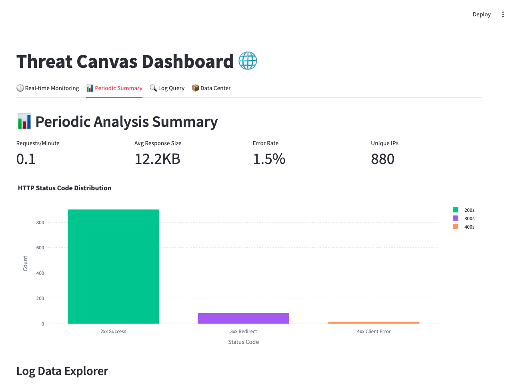
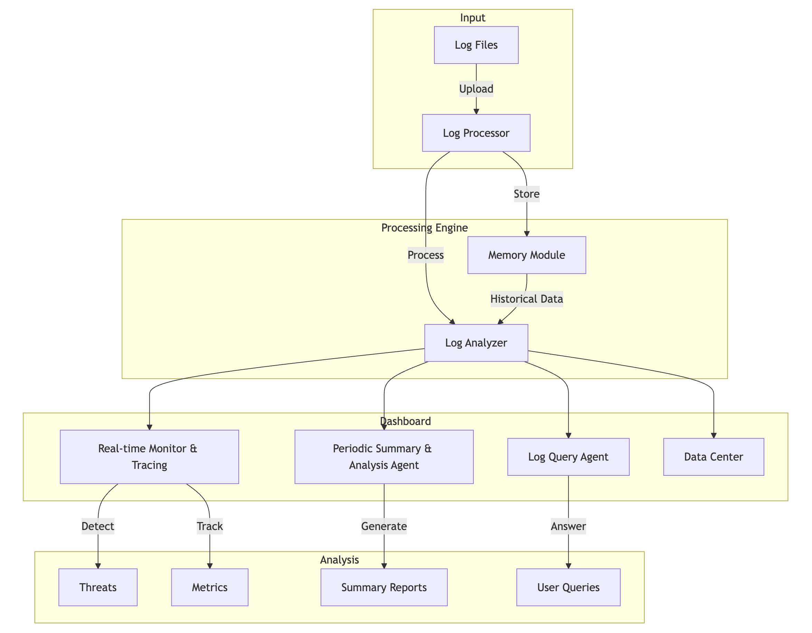

<div align="center">
<h1>ThreatCanvas 🛡️</h1>
<video src="assets/threatcanvas.mp4" autoplay loop muted></video>
</div>


ThreatCanvas is an advanced real-time log analysis and threat detection system powered by AI. It combines long-term memory capabilities with LLM reasoning to provide intelligent insights into your system's security landscape.

## 🌟 Key Features



### 🔄 Real-time Monitoring
- **Live Threat Detection**: Continuous monitoring with AI-powered analysis
- **Long-Term Memory**: Maintains context of historical threats and patterns
- **Batch Processing**: Processes 30 logs at fixed intervals
- **Intelligent Pattern Recognition**: Uses LLM reasoning for advanced threat detection

### 🔍 Agent Analysis & Log Summary

- **Suspicious IP Detection**: Identifies and tracks potentially malicious IP addresses
- **User Agent Analysis**: Analyzes browser patterns and bot activities
- **Response Anomaly Detection**: Flags unusual response sizes and patterns
- **Historical Pattern Matching**: Correlates current activities with past incidents

### 📊 Log Query Visualization

- **Interactive Chat Interface**: Natural language queries for log analysis
- **Dynamic Visualizations**: Real-time charts and graphs
- **Custom Analytics**: Generate specific insights based on user queries
- **Data Export**: Export analysis results and visualizations

## 🚀 Quick Start

### Prerequisites

- Python 3.8+
- Azure OpenAI API key
- Mem0 API key for long-term memory storage
- AWS access key and secret access key for Anthropic Sonnet model from AWS Bedrock.

### Installation

1. Clone the repository:
```bash
git clone https://github.com/mukeshthawani/ThreatCanvas
cd ThreatCanvas
```

2. Install dependencies:
```bash
pip install -r requirements.txt
```

3. Configure environment variables:
```bash
cp .env.example .env
# Edit .env with your API keys
```

### Usage

1. Start the application:
```bash
streamlit run app.py
```

2. Upload your log file (CSV format)

```
Dataset:
Access Log*: https://www.kaggle.com/datasets/eliasdabbas/web-server-access-logs
LogHub: https://github.com/logpai/loghub?tab=readme-ov-file

* Used in our case
```

3. Navigate through different tabs:
   - 🕒 Real-time Monitoring
   - 📊 Periodic Summary
   - 🔍 Log Query
   - 📦 Data Center

## 🏗️ Architecture



ThreatCanvas is built with a modular architecture:

- **Memory Module**: Handles long-term storage and retrieval of threat patterns
- **Processor**: Manages real-time log processing and analysis
- **Log Analyzer**: Performs detailed analysis of log patterns
- **Query Agent**: Handles natural language processing for log queries
- **Visualization Engine**: Generates interactive charts and graphs

## 🤝 Contributing

Contributions are welcome! Please feel free to submit a Pull Request.

## 📄 License

This project is licensed under the MIT License - see the [LICENSE](LICENSE) file for details.

## 🙏 Acknowledgments

- Azure OpenAI for LLM capabilities
- Langchain for Agentic workflow and prompt wrappers
- Mem0 for long-term memory storage
- Streamlit for the interactive interface
- AWS Bedrock for periodic summary

## 📞 Support

For support, please open an issue in the GitHub repository or contact the maintainers.
---

